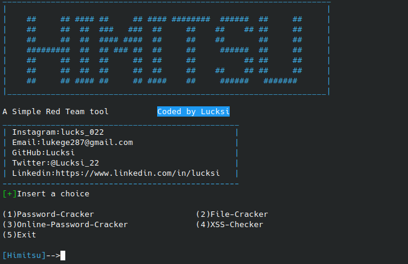
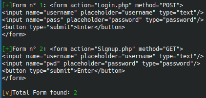
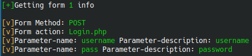

<p align = "center">

</p>

<p align = "center">
  
  
  
  
  
  
  
</p>


**Himitsu is a Online/Offline Red Team tool focused on Password Cracking and Web Vulnerabilities**

## DISCLAIMER

**This tool is intented only for educational and testing purposes only. I do not assume any liability for any bad/illegal usage of this tool.**

## Password Folder

**In order to make the password modules works is necessary to add to 'Passwords/Default' Files with .txt extension ex (Example.txt)** 


## Screenshot:



## Installation:
```bash
git clone https://github.com/Lucksi/Himitsu
cd Himitsu
sudo apt-get update
sudo chmod +x install.sh
sudo bash install.sh
pip3 install -r requirements.txt
```

## Installation (Venv):
**if you encounter some errors in the python libraries installation use this method:**
```bash
git clone https://github.com/Lucksi/Himitsu
sudo apt-get update
cd Himitsu
python3 -m venv .lib_venv
sudo chmod +x install.sh
sudo bash install.sh
source .lib_venv/bin/activate
pip3 install -r requirements.txt
```

## Execution:
```bash
cd Himitsu
python3 main.py
```
## Execution (Venv)
```bash
cd Himitsu
source .lib_venv/bin/activate
python3 main.py
```

## Configuration Options:

| Option name | Type | Description |  Default Value |  
| ------------- | ------------- | ------------- | ------------- | 
| `USERAGENT_PATH` | String | File path of the Useragent list | Useragent/List.txt
| `TOR_PROXY`  | True/False | Making web request throught Tor network | False
| `USERAGENT_CHANGE` | True/False | Making your Useragent different after a certain number of requests | False
| `BREAK_TIME` | Number | Number of requests to reach in order to change Useragent | 5

## Features:

| Option name | Description |
| ------------- | ------------- |
| `Algorithm Recognition`  | Automatic recognition of the algorithm that have been used to hash or encode a password|
| `Useragent changing`  | After a certain number of request your useragent will change in to a new one |
| `Tor Proxies`  | Run your connections throught Tor |
| `Html Forms Detection`  | Gathering all the html forms in a webpage |
| `Automated http request`  | Creation of the url and setting the comunication method for making a web request|

<br>

| Form Detecion | Parameters Detection |
| ------------- | ------------- |
|   | |


## Current Hashing and Encoding Algorithm Supported:

| Name | Recognition |
| ------------- |  ------------- |
| `BASE64` | :heavy_check_mark: |
| `BASE32` |   :heavy_check_mark: |
| `MD5`  | :heavy_check_mark: |
| `SHA1`  | :heavy_check_mark: |
| `SHA224` | :heavy_check_mark: |
| `SHA3-224`  | :heavy_check_mark: |
| `SHA256`  | :heavy_check_mark: |
| `SHA3-256`  | :heavy_check_mark: |
| `SHA384`  | :heavy_check_mark: |
| `SHA3-384`  | :heavy_check_mark: |
| `SHA512`  | :heavy_check_mark: |
| `SHA3-512`  | :heavy_check_mark: |

## Current Offline Cracking Options:

| Options
| ------------- 
| `Password`
| `Zip File`
| `Rar File`
| `7zip File`
| `Pdf File`


## Current Form info Gathered:

| Option name | Description |
| ------------- | ------------- |
| `Action Detection`  | Recognizion of the action url |
| `Method Detection`  | Recognizion of the method used in order to transfer data (POST/GET) |
| `Parameters`  | Recognizion of Parameter name (and description when possible) |

## Current Attacks/Decoding:

| Option name | Mode |
| ------------- | -------------
| `Password Cracking` | Offline/Online |
| `Xss Injection`  | Offline/Online |
| `Base64 Decoding` | Offline |


## STARGAZERS OVER TIME 


[](https://starchart.cc/Lucksi/Himitsu)

<br>

## <p align = center>  ORIGINAL CREATOR: <a href = "https://github.com/Lucksi">LUCA GAROFALO (Lucksi)</a></p>


## <p align = center>LICENSE: GPL-3.0 License <br>COPYRIGHT: (C) 2024 Lucksi  